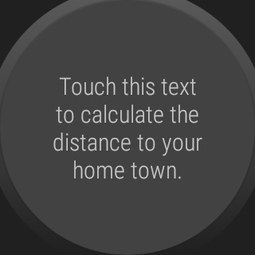
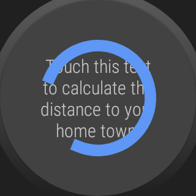
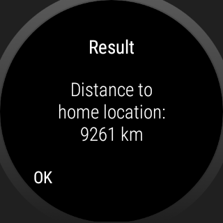

# WearOS-App: "GPS-Ortung"

Android-Studio-Project for a WearOS-App which shows how GPS locating of smartwatch can
be accessed. For this the runtime permission model has to be considered.

 

----
## Screenshots

 

  

 

 

Screenshots were taken from emulator.

 

----
# License

See the [LICENSE file](LICENSE.md) for license rights and limitations (BSD 3-Clause License).
